<!-- .slide: data-menu-title="Title page" data-background-image="images/TG-on-white.png" data-background-opacity="1.0" -->
## Toegankelijkheid

Note:
  Webserver presentation, so start server in slides directory
  Slides on iCloud:
    cd ~/Library/Mobile\ Documents/com~apple~CloudDocs/
  Start server in slides directory
    python -m SimpleHTTPServer (Python2)
    python3 -m http.server 9000 (Python3)
  View by browsing to:
    http://localhost:8000 (Python2)
    http://localhost:9000 (Python3)

  Hidden features:
  Speaker notes window : hit »S« on your keyboard.
  Pause npresentation :  hit »B« or ».«

---

<!-- .slide: data-menu-title="Introductie" -->
## Introductie

Wat is toegankelijkheid...     <!-- .element: class="fragment" data-fragment-index="1" -->

Alleen fysieke toegankelijkheid?     <!-- .element: class="fragment" data-fragment-index="2" -->

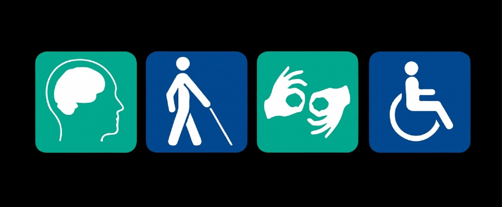

Note:
Gebruikelijk argument: hier komt nooit iemand met een rolstoel
Dat is nogal logisch als je met een rolstoel daar niets kunt
Simpel kip en ei verhaal!

--

## Bewustwording nodig

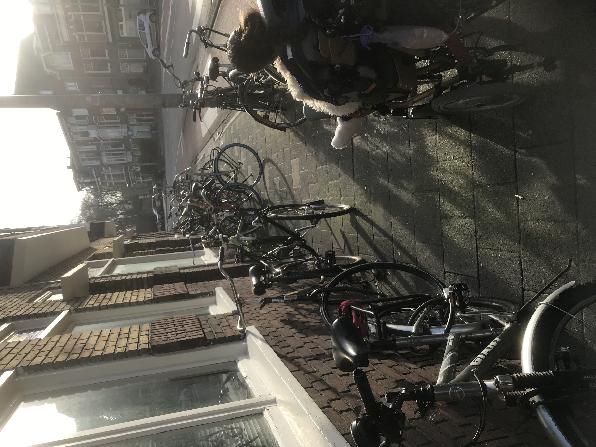

Note:
Vooral in de stad Groningen is fietsoverlast een groot probleem.
Daar zijn we als werkgroep ook bij betrokken
De gemeente start met een campagne voor bewustwording

--

## Onderwijs (2)

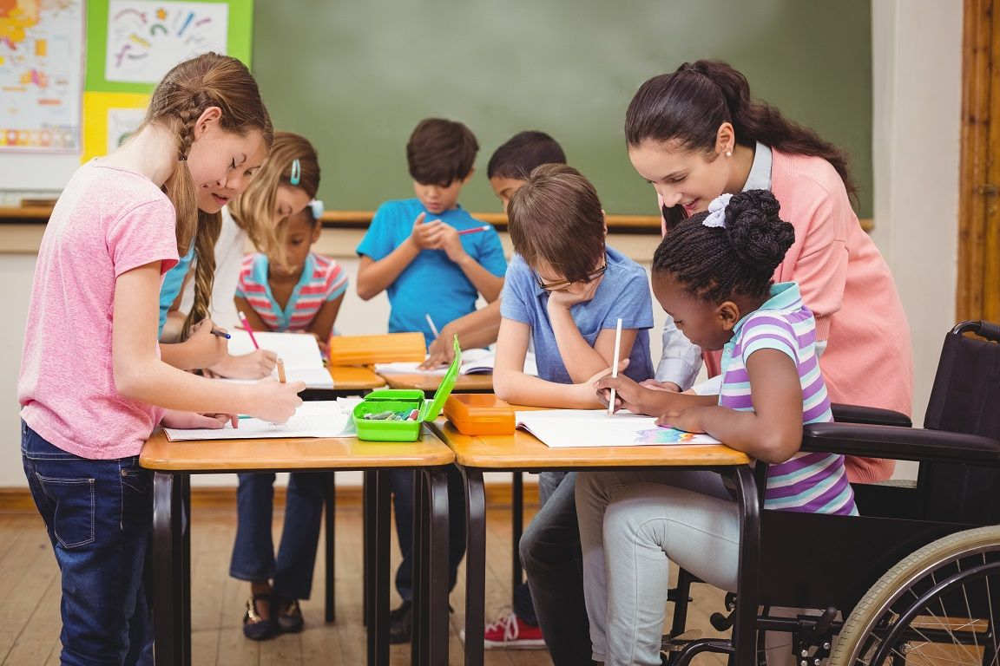

Note:
Inclusief onderwijs: Kinderen al direct leren dat niet iedereen gelijk is.
Spelenderwijs incklusiviteit laten ontstaan.
Je wilt toch ook graag naar een school vlakbij?
Vrijwilligers, voorleesmoeders, hebben soms ook een (tijdelijke) beperking

--

## Persoonlijke mobiliteit (2)

Note:
Voorbeeld/foto : Voetgangersstoplichten met rateltikker

--

## Sport (2)

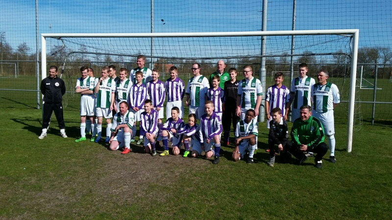

Note:
Ook organiseert Kids United wedstrijden tegen de reguliere jeugd
Een mooi voorbeeld van integratie

--

## Toegang tot Informatie (2)

Note:
Voorbeeld/foto Bus: bushalte met Digitaal Route informatie systeem en knop
Toegang tot informatie gaat ook over:
- Laaggeletterdheid
- Digitale snelweg

--

## Werk (2)

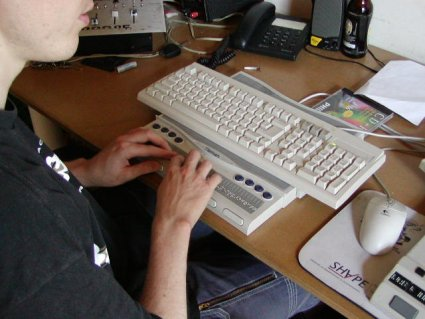

--

## Recreatie (2)

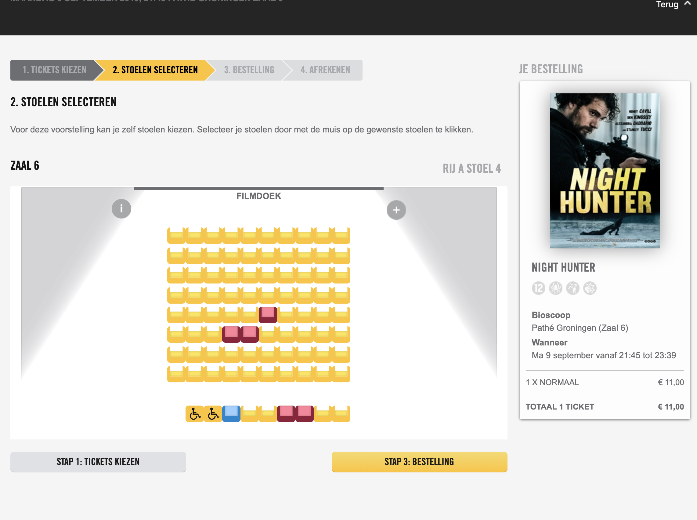

Note:
Recreatie - Film: stoel reserveren bij Pathé

--

## Wonen (2)

--

## Zorg (2)

Note:
Zorg: JvS: zelf draaien in ziekenhuis

--

### Definitie

Toegankelijkheid is de basis om volwaardig mee te doen aan de samenleving

- Bewustwording         <!-- .element: class="fragment" data-fragment-index="1" -->
- Wederzijds respect    <!-- .element: class="fragment" data-fragment-index="2" -->
- Kosten?               <!-- .element: class="fragment" data-fragment-index="3" -->

---

<!-- .slide: data-menu-title="VN-Verdrag Handicap" -->
## VN-Verdrag Handicap

Verdrag is in 2006 door de Verenigde Naties aangenomen

Door Nederland geratificeerd in 2016

College voor de rechten van de mens: jaarlijks rapport
Bron zijn mensen en organisaties

Note:
Dit rapport gaat over de eerste twee jaar van het VN-verdrag in Nederland.
Het College heeft hierover contact gehad met mensen met een beperking.
En met organisaties voor en door mensen met een beperking.

--

## Dit gaat goed

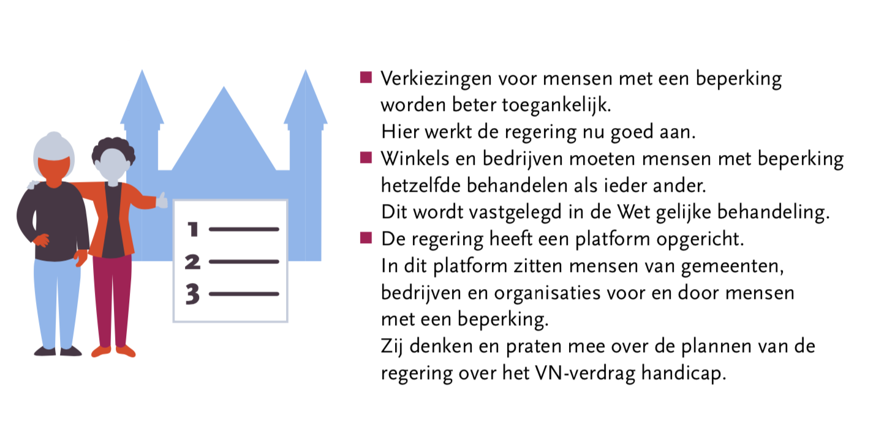

--

## Dit gaat minder goed

**Algemeen**

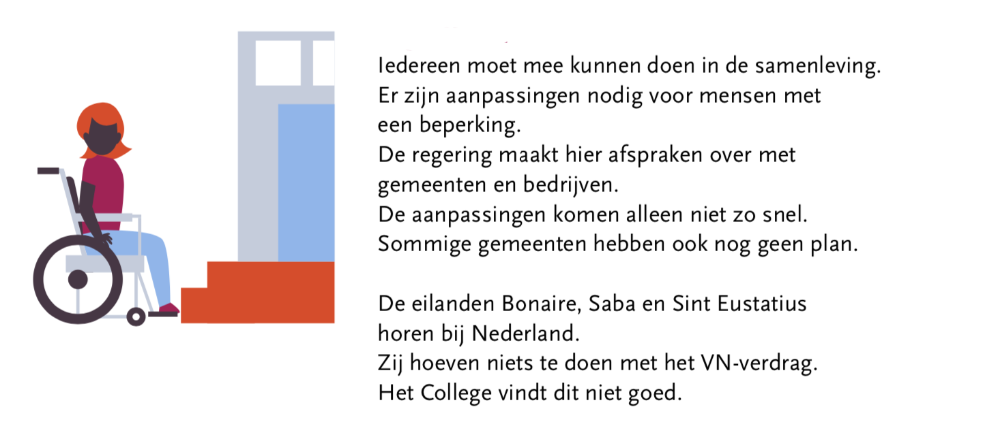

--

## Gelijkheid voor de wet

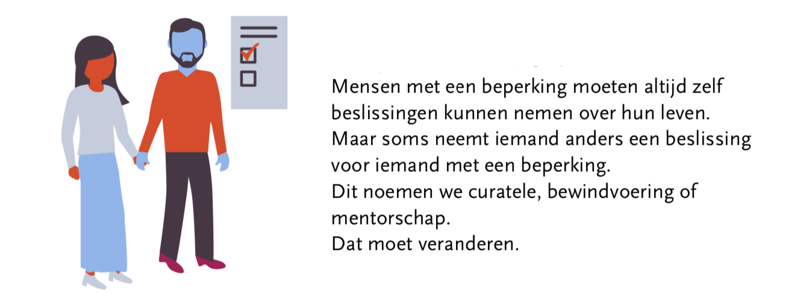

--

## Maatschappelijke ondersteuning

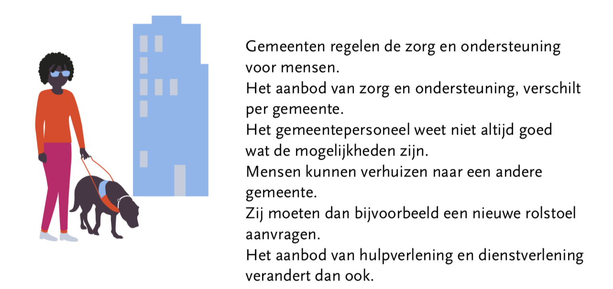

--

## Gezondheid

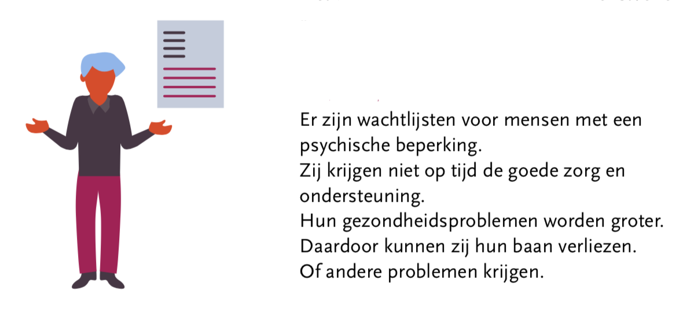

--

## Onderwijs

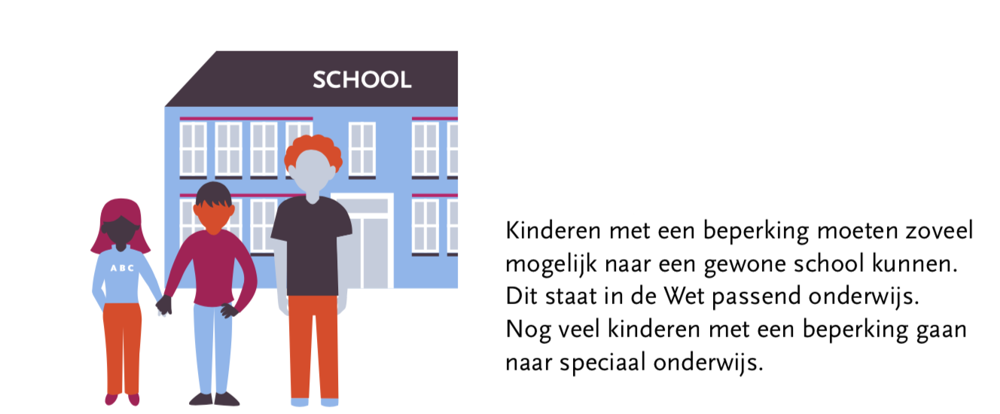

--

## Arbeidsmogelijkheden

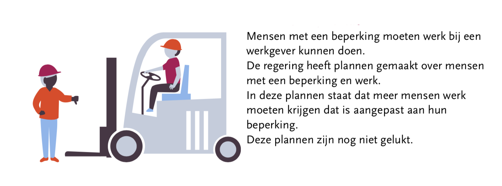

---

<!-- .slide: data-menu-title="VNG aanpak" -->
## VNG Aanpak

Nederland: 355 gemeenten

VNG Koplopersprogramma VN-Verdrag Handicap

26 koploper gemeentes geselecteerd

- informatie delen
- goede voorbeelden zichtbaar maken
- lopende initiatieven groter maken

--

## Om wie gaat het

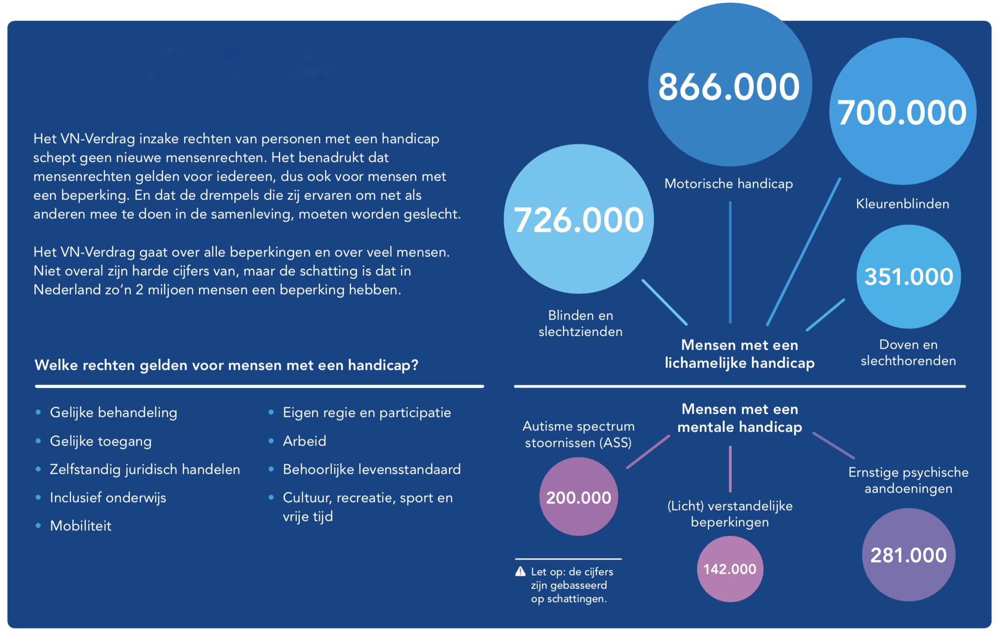

--

## Locale inclusie kaart

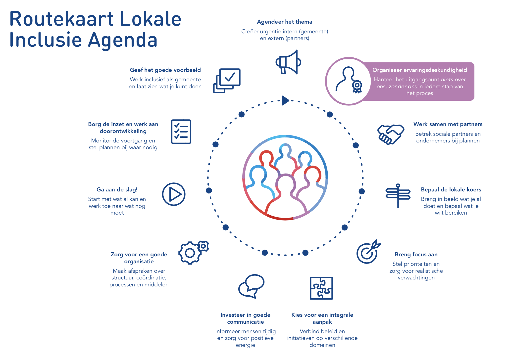

Note:
- Niets over ons zonder ons

--

## Inspiratiebundel

Essentie:
**Organiseer ervaringsdeskundigheid**

- Willen
  - Locale inclusie agenda
- Kunnen
  - Beleidsmedewerker Inclusie
- Doen
  - Leren door te doen
  - Stap voor stap

Note:
Amendement Van der Staaij en Bergkamp ter vervanging van nr. 19:
Het is de bedoeling van de indieners dat gemeenten één integraal plan ontwikkelen voor het hele sociale domein. Concreet kan dit worden uitgewerkt in een Lokale Inclusie Agenda. Het is uitdrukkelijk de bedoeling van de indieners dat mensen met een beperking en hun vertegenwoordi- gende organisaties bij het opstellen van het beleid betrokken worden.

---

<!-- .slide: data-menu-title="Toegankelijkheid Handvatten" -->
## Toegankelijkheid - Handvatten?

Eenvoudige vraag:

**Wat zijn de eisen, waaraan moet het voldoen?**

--

## Standaarden

- Bouwbesluit 2012
- Handboek voor Toegankelijkheid
- Vanuit Toegankelijk Groningen:
  - Handreiking Toegankelijkheid 2017
  - Integrale Toegankelijkheid v1.1

**Maar...**                      <!-- .element: class="fragment" data-fragment-index="1" -->

- Veel ruimte voor interpretatie <!-- .element: class="fragment" data-fragment-index="1" -->
- Navolging soms beperkt         <!-- .element: class="fragment" data-fragment-index="1" -->
- Wachten op bouwbesluit?        <!-- .element: class="fragment" data-fragment-index="1" -->

--

## Keurmerken

- ITS van PBTconsult
- NL keurmerk voor Toegankelijkheid
- Talloze lokale keurmerken

**Maar...** <!-- .element: class="fragment" data-fragment-index="1" -->

- Kostbaar                 <!-- .element: class="fragment" data-fragment-index="1" -->
- Beperkt houdbaar         <!-- .element: class="fragment" data-fragment-index="1" -->
- Niet open                <!-- .element: class="fragment" data-fragment-index="1" -->
- Teveel bomen in het bos  <!-- .element: class="fragment" data-fragment-index="1" -->

--

## Hoe verder...

- Ontoegankelijkheid is vaak geen opzet       <!-- .element: class="fragment" data-fragment-index="1" -->
- Laat beslissers zelf ervaren                <!-- .element: class="fragment" data-fragment-index="1" -->
- Het begint met er over praten: (h)erkennen  <!-- .element: class="fragment" data-fragment-index="1" -->
- Vraag mensen die dat ondervinden            <!-- .element: class="fragment" data-fragment-index="2" -->
- Ervaringsdeskundigen kunnen helpen          <!-- .element: class="fragment" data-fragment-index="3" -->

**Zoek ervaringsdeskundigen en betrek ze!** <!-- .element: class="fragment" data-fragment-index="4" -->

Note:
Vaak geen opzet, onwil, of doel maar onwetendheid, of angst/handelingsverlegenheid
Zelf ervaren (geef de wethouder een handicap) geeft pas echt inzicht!
Ervaringsdeskundigen kunnen meehelpen, zoek ze en betrek ze

---

<!-- .slide: data-menu-title="Pauze" -->
## Pauze

---

<!-- .slide: data-menu-title="Toegankelijk Groningen" -->
## Toegankelijk Groningen

Voor 2016:

- Adviesraad gehandicaptenbeleid
- PCG Website Toegankelijk Groningen

In 2016:                                       <!-- .element: class="fragment" data-fragment-index="1" -->
- Gehandicaptenadviesraad Groningen afgeschaft <!-- .element: class="fragment" data-fragment-index="1" -->
- Ratificatie VN-Verdrag Handicap              <!-- .element: class="fragment" data-fragment-index="1" -->
- Werving Keurmeesters: vanaf december         <!-- .element: class="fragment" data-fragment-index="1" -->

Note:
Historie:
Voorloper: Gehandicapten Adviesraad - was veelal laatste schakel
In Groningen afgeschaft per 1-1-2016
PCG Website Toegankelijk Groningen
Website Filosofie, voor mobi/doof/blind
Ontstaan vanuit PCG Keurmeesters
Nu adviseurs Toegankelijkheid
Contacten Klaas van der Berg in 2016
Jan Martini vanaf december 2016 werving via Link050: vrijwilligersbank : verzekerd etc.

--

## Werkgroep TG

Netwerk van en voor \'mensen met een handicap\' in de Gemeente Groningen
- Handicap-breed en sociaal!
Onze \'bloedgroepen\' zijn:
- burgers met een fysieke handicap en meestal ook mobiliteits-gedoe.
- blinden en slechtzienden.
- de gemeenschap van doven en slechthorenden.
- mensen met een verstandelijke beperking.
- burgers met een psychische handicap.

Note:
Hierbij hoort ook Dementie

--

## Handicap \'criteria\'

Iedereen met \'kan niet schelen welke afstand tot de mainstream-maatschappij\' die binnen de handicap-criteria valt, hoort erbij.

Criteria zijn in normaal Nederlands:
- Het gaat niet over.
- Je hebt er elke dag last van.
- Het betreft meerdere leefterreinen: geen ontkomen aan.
- Het levert voortdurend participatie-problemen op.

--

## Ervaringsdeskundigen

- Experts in het overleven van onmogelijke omstandigheden\: als \'even\' niks meer vanzelf gaat.
- Net als iedereen willen we allemaal wat anders\: een handicap is geen identiteit.

--

## Samenwerken

Werkgroep als **verbindende schakel en netwerk**
Samen sterker, gebruik elkaars ervaring en kwaliteiten.

***Bondgenoten*** mobiliseren als je even verder nadenkt dan je eigenbelang smal is.

--

## Doel en koers

Handen \& voeten geven aan VN-verdrag \'Handicap\'
- Wonen: aanpassingen in en om je huis tot acceptatie buurt
- Opleidingen en onderwijs
- Openbare ruimte en de toegankelijkheid van voorzieningen
- Sport en recreatie
- Cultuur, toerisme, festivals en evenementen
- De digitale snelweg
Benut onze creativiteit & veerkracht, op weg naar een duurzame samenleving

Note:
Ook noemen:
  Digitale snelweg is ook "Toegang tot Informatie" net als Laaggeletterdheid
  Dementie ook meenemen

--

## Werkwijze

- Overleg gemeente: 2-wekelijks
- Meedenken in plaats van eisen
- Scannen communicatie gemeente
- Overleg projectleiders
- Wandeling wethouder Toegankelijkheid
- Deelname Let\'s Gro
- Overleg WIJ-Stichting

Note:
Overleg in de hal: zichtbaar zijn!
Nog lange weg naar natuurlijke consultatie
WIJ- stichting is de uivoerder van WMO in Groningen

--

## Output

- Toegankelijke verkiezingen
- Forum, Stadhuis, scholen, MFC\'s, Station, Bushaltes, Vrijdag, Oosterpoort, Kunstwerf, sportcentra
- Toegankelijkheid alle festivals
- Live ondertiteling Raadsvergaderingen 1-1-2020
- RTV-Noord ondertiteling

Note:
Verkiezingen: incl. Dovengemeenschap!
Grunn Gras
Parkeerbeleid
Documenten:- Brochures

- Handreiking Toegankelijkheid 2017
- Integrale toegankelijkheid 2019
- Waaier Toegankelijkheid HoreCa

---

<!-- .slide: data-menu-title ="SWOT Toegankelijkheid" -->
## SWOT Toegankelijkheid

- 4 slides
  - Sterke punten Veendam
  - Zwakke punten Veendam
  - Kansen Veendam
  - Bedreigingen Veendam
- 4 groepen
- invullen/aanvullen punten
- 5 punten per slide te geven
- rouleren na 5 minuten

--

## Afronding

Samenvatting slides

Waar gaan jullie mee aan de slag\: <!-- .element: class="fragment" data-fragment-index="1" -->
- Gemeente\?                       <!-- .element: class="fragment" data-fragment-index="1" -->
- Ervaringsdeskundigen\?           <!-- .element: class="fragment" data-fragment-index="1" -->

Note:

Advies: begin klein & concreet
Landelijk Sportakkoord – Veendammer Sportakkoord?

--

## Einde

Bedankt!

**Veel succes met de implementatie**